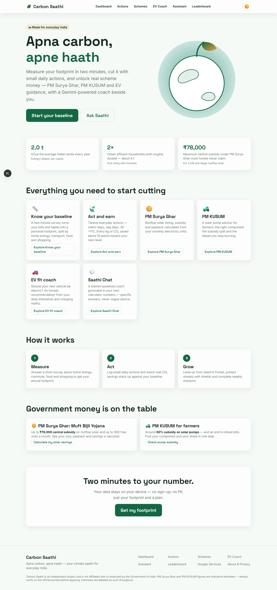
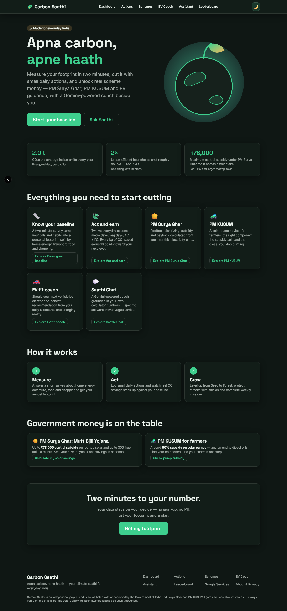
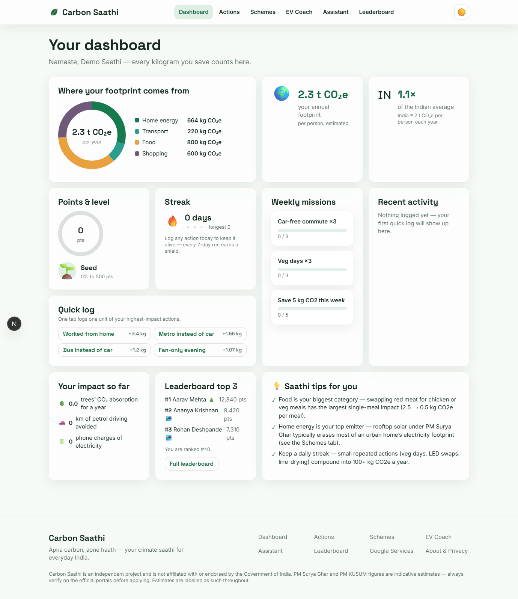
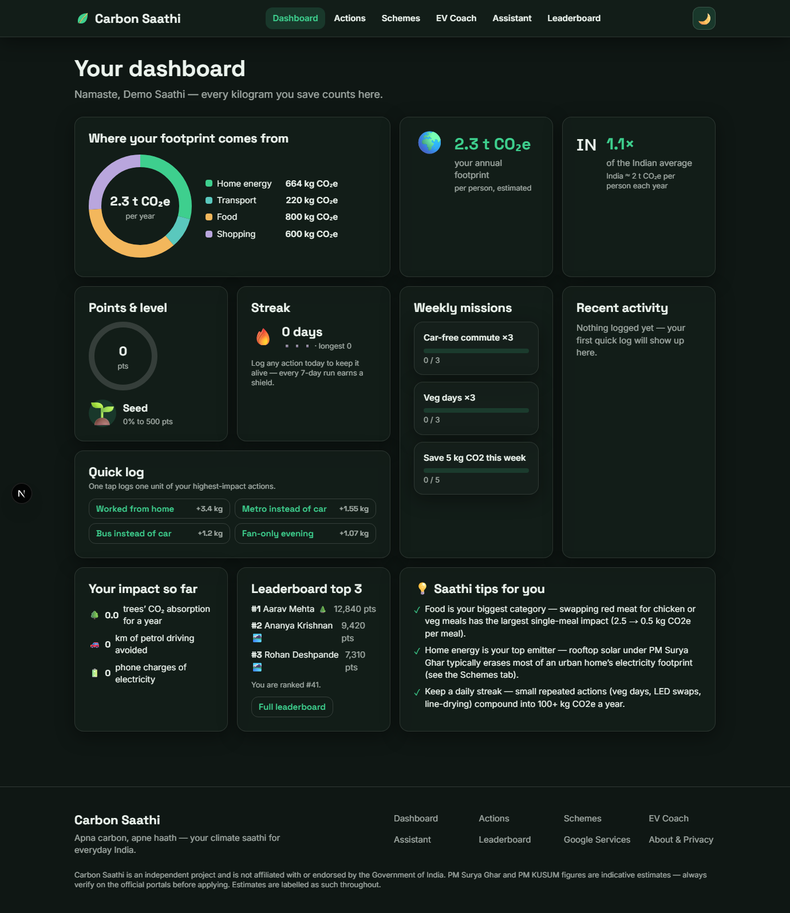
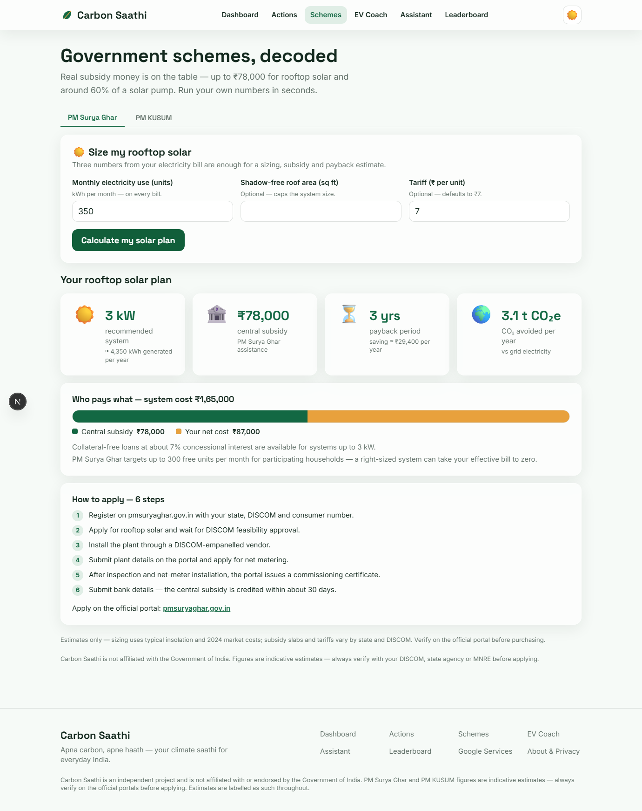
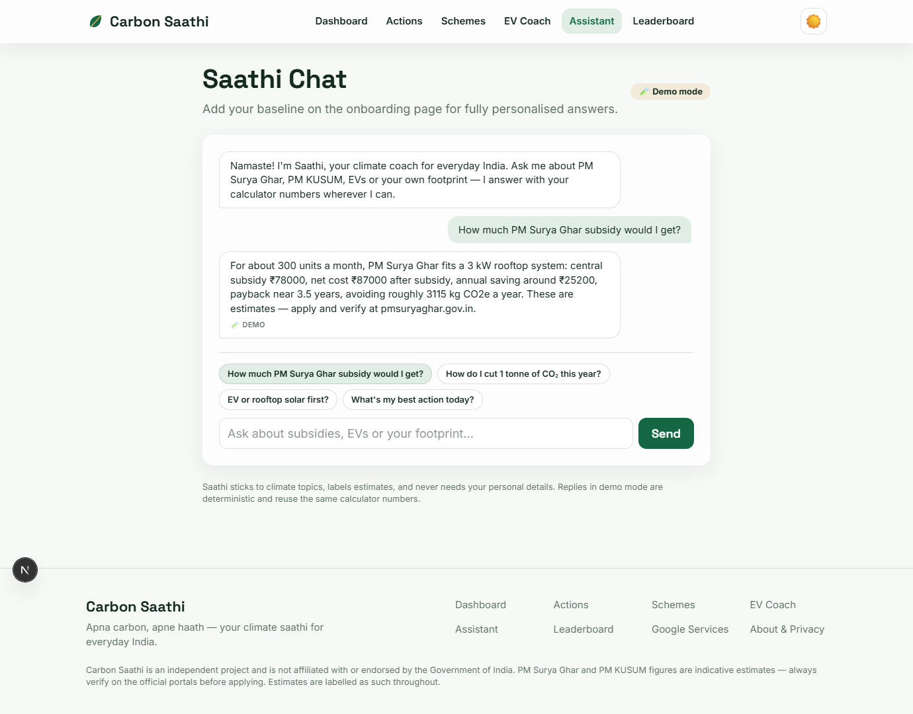
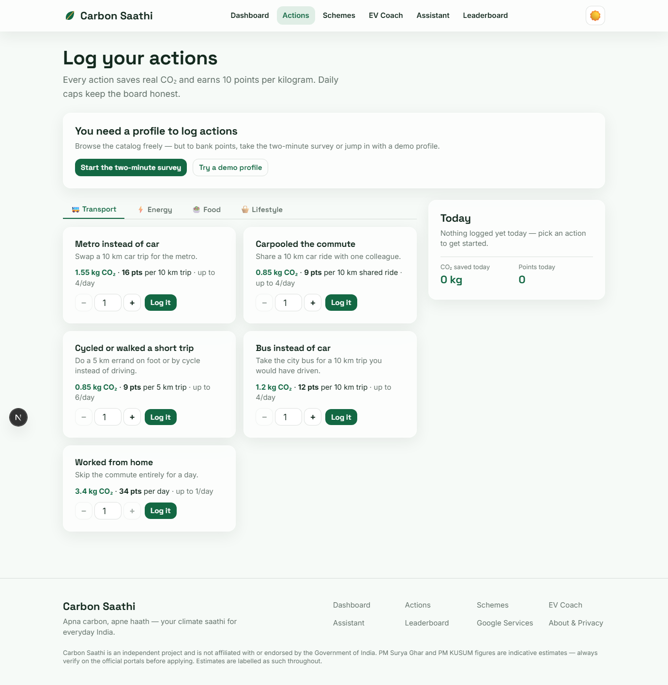
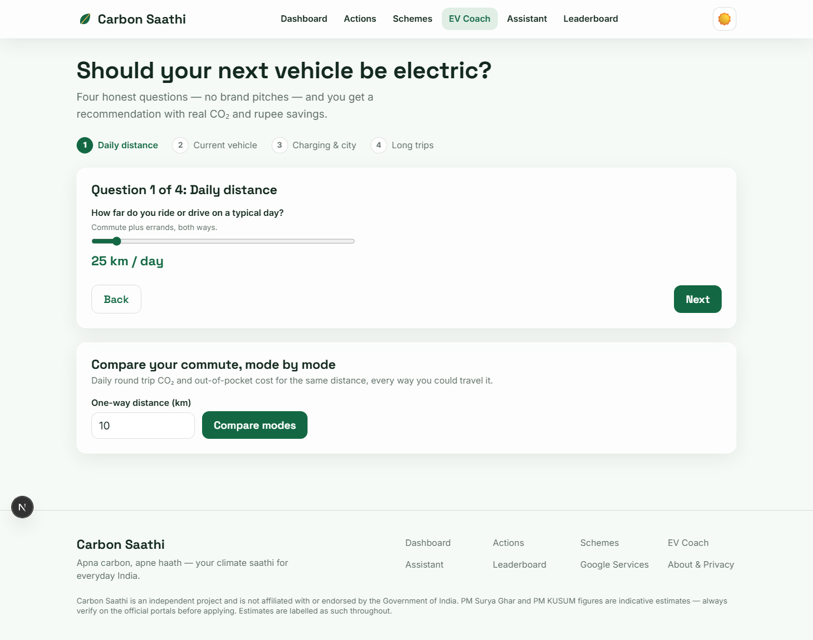
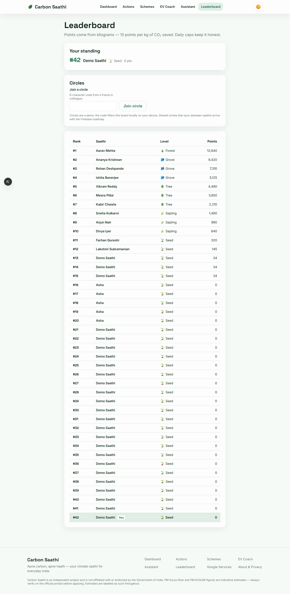
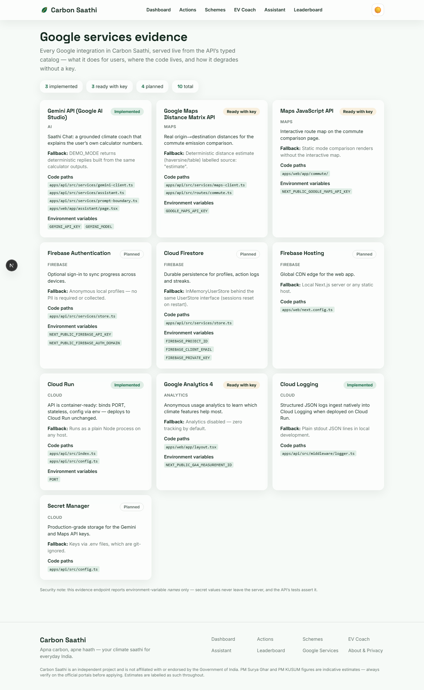

# Carbon Saathi

**Your climate saathi for everyday India.** Measure, understand, and reduce your carbon
footprint through simple actions and personalised insights — grounded in real Indian schemes
(PM Surya Ghar, PM KUSUM), EV adoption guidance, and a Gemini-powered coach.

India's energy-related footprint averages **~2 tonnes CO₂e per person per year**, but urban
affluent lifestyles already run at **~4 tonnes**. Carbon Saathi turns that abstract gap into a
personal baseline, a daily action habit, and concrete rupee-denominated next steps — like a
rooftop solar plan with the exact **₹30,000 / ₹60,000 / ₹78,000** PM Surya Ghar subsidy band
and payback years for *your* electricity bill.

Built with **Google Antigravity + Gemini**.

---

## ✨ Highlights

| Rubric axis | How Carbon Saathi delivers |
|---|---|
| **Code Quality** | Strict TypeScript everywhere (no `any`), pure deterministic domain engine in [`packages/core`](packages/core/src) with `Result<T, AppError>` instead of cross-boundary throws ([`result.ts`](packages/core/src/result.ts), [`errors.ts`](packages/core/src/errors.ts)). Every source file opens with a responsibility/boundary header; every non-obvious number cites its source inline ([`emission-factors.ts`](packages/core/src/emission-factors.ts)). Shared zod schemas keep web and API in lock-step ([`schemas.ts`](packages/core/src/schemas.ts)). |
| **Security** | Helmet CSP, CORS allowlist, 32 kb JSON body cap, per-IP token-bucket rate limiting (stricter on the assistant), zod validation on every POST, prompt-injection boundary delimiters around all untrusted input ([`prompt-boundary.ts`](apps/api/src/services/prompt-boundary.ts)), secrets only via env (names — never values — exposed by the evidence route, with a test asserting it). Full threat table: [SECURITY.md](SECURITY.md). |
| **Efficiency** | Zero-dependency domain core (zod only), in-memory stores and caches with a pagination-ready interface, deterministic fallbacks instead of network retries, ≤180-word assistant token budget, lazy-loaded heavy UI, structured logs (no payload echo). Decisions documented in [ARCHITECTURE.md](ARCHITECTURE.md#efficiency-decisions). |
| **Testing** | Unit (one vitest file per core module, [`packages/core/src/__tests__`](packages/core/src/__tests__)), API integration via supertest ([`apps/api/src/__tests__`](apps/api/src/__tests__)), web component tests (RTL + jsdom), Playwright e2e journeys, and automated axe-core accessibility scans ([`e2e/a11y.spec.ts`](e2e/a11y.spec.ts)). Layer matrix and honest gaps: [TESTING.md](TESTING.md). |
| **Accessibility** | WCAG 2.1 AA by design: skip-link, semantic landmarks, labelled inputs, focus-visible rings, 4.5:1+ token contrast (computed ratios documented), full keyboard journey, `aria-live` feedback, `prefers-reduced-motion` honoured in CSS and framer-motion. Evidence: [ACCESSIBILITY.md](ACCESSIBILITY.md). |
| **Google Services** | 10 integrations in a typed, API-served catalog ([`service-catalog.ts`](packages/core/src/google/service-catalog.ts)) — Gemini API (implemented), Maps Distance Matrix (ready-with-key), Cloud Run + Cloud Logging (implemented), Firebase Auth/Firestore/Hosting + Secret Manager (planned, interfaces ready). Live evidence page at `/google-services`. Per-service contract: [GOOGLE_SERVICES.md](GOOGLE_SERVICES.md). |

---

## 🌱 What it does

- **Baseline footprint survey** — 5-step wizard converts household electricity, LPG, commute,
  flights, diet, and shopping into annual kg CO₂e per person, benchmarked against the
  India average (~2 t) and urban affluent (~4 t), using CEA's grid factor of
  **0.716 kg CO₂/kWh**.
- **Daily action log** — a 12-action catalog (metro instead of car, veg day, AC +1 °C, …)
  with per-unit CO₂ savings, points, levels (Seed → Forest), streaks with shields, and
  weekly missions.
- **PM Surya Ghar calculator** — recommends rooftop kW from your monthly units, applies the
  central subsidy bands (₹30k for 1 kW, ₹60k for 2 kW, ₹78k cap at 3 kW+), explains the
  **300 free units** narrative, and outputs payback years plus a 6-step application checklist
  linking [pmsuryaghar.gov.in](https://pmsuryaghar.gov.in).
- **PM KUSUM advisor** — routes farmers to Component A/B/C with the **30% central + 30% state
  / 40% farmer** split, diesel litres displaced, and CO₂ avoided.
- **EV fit coach** — recommendation engine (EV 2-wheeler / EV car / hybrid /
  public-transport-first) with annual CO₂ and fuel-cost savings.
- **Commute comparison** — per-mode CO₂ and cost for your distance; uses Google Maps
  Distance Matrix when a key is present, deterministic estimates otherwise.
- **Saathi Chat** — Gemini-powered coach grounded in *your* calculator outputs
  (never invented numbers), with a deterministic demo mode that reuses the same math.
- **Leaderboard & circles** — friendly competition seeded with deterministic demo entries.

## 🚀 Quick start

Three commands, zero keys required:

```bash
npm install     # Node >= 20; installs all workspaces
npm test        # core unit + API integration + web component suites
npm run dev     # boots API on :8080 and web on :3000
```

Then open **http://localhost:3000**.

**Demo mode (default):** with no API keys configured, `DEMO_MODE=true` and every Google
integration degrades gracefully — the assistant returns deterministic replies built from the
*same* calculator outputs, commute comparison uses labelled estimates, and all 10 pages
render fully. Copy [`.env.example`](.env.example) to `.env` and add keys whenever you want
live Gemini/Maps; nothing else changes. See [GOOGLE_SERVICES.md](GOOGLE_SERVICES.md) for the
per-service activation walkthrough.

End-to-end and accessibility suites (require the dev servers' ports to be free):

```bash
npm run e2e     # Playwright: smoke, journey, schemes, assistant
npm run a11y    # axe-core scan across all 10 routes
```

## 📸 Screenshots

Captured by the Playwright suite into [`e2e/screenshots/`](e2e/screenshots)
(regenerate anytime with `npx playwright test e2e/screenshots.spec.ts`):

| Light | Dark |
|---|---|
|  |  |
|  |  |

| Flow | Capture |
|---|---|
| PM Surya Ghar calculator result (350 units → ₹78,000) |  |
| Saathi Chat replying with grounded numbers |  |
| Action logging catalog |  |
| EV fit coach |  |
| Leaderboard with your row highlighted |  |
| Google services evidence page |  |

## 🏗️ Architecture at a glance

```
┌────────────────────────────┐      ┌─────────────────────────────┐
│  apps/web  (Next.js 15)    │ /api │  apps/api  (Express 4)      │
│  App Router · React 19     ├─────►│  Cloud Run-ready · helmet   │
│  Tailwind v4 · framer      │proxy │  CORS · rate limit · zod    │
└────────────┬───────────────┘      └──────────────┬──────────────┘
             │  imports types/schemas              │ imports calculators
             ▼                                     ▼
        ┌─────────────────────────────────────────────────┐
        │  packages/core  (@carbon-saathi/core)           │
        │  pure, deterministic domain engine — zod only   │
        └─────────────────────────────────────────────────┘
                       │ outbound (optional, key-gated)
                       ▼
        Gemini API · Maps Distance Matrix · (Firestore roadmap)
```

Full diagrams and data flows (baseline calc, action log, assistant grounding, commute
fallback): [ARCHITECTURE.md](ARCHITECTURE.md).

## 🗂️ Monorepo file index

| Path | What lives here | When to read |
|---|---|---|
| [`packages/core/src/emission-factors.ts`](packages/core/src/emission-factors.ts) | Every India-specific factor with provenance | To audit any number the app shows |
| [`packages/core/src/baseline.ts`](packages/core/src/baseline.ts) | Survey → annual footprint math | To verify the footprint calculation |
| [`packages/core/src/surya-ghar.ts`](packages/core/src/surya-ghar.ts) | PM Surya Ghar sizing, subsidy bands, payback | To check the solar economics |
| [`packages/core/src/kusum.ts`](packages/core/src/kusum.ts) | PM KUSUM A/B/C routing + subsidy split | To check the farmer advisory |
| [`packages/core/src/ev-fit.ts`](packages/core/src/ev-fit.ts) | EV recommendation decision tree | To check EV savings claims |
| [`packages/core/src/actions.ts`](packages/core/src/actions.ts) | 12-action catalog with per-day caps | To see anti-gaming bounds |
| [`packages/core/src/gamification.ts`](packages/core/src/gamification.ts) | Points, levels, streak shields, missions | To understand the habit loop |
| [`packages/core/src/google/service-catalog.ts`](packages/core/src/google/service-catalog.ts) | Typed Google-integration evidence catalog | To verify Google Services claims |
| [`packages/core/src/__tests__/`](packages/core/src/__tests__) | One vitest file per core module | To see realistic Indian test scenarios |
| [`apps/api/src/server.ts`](apps/api/src/server.ts) | `buildApp(config)` factory — all hardening wired here | To review the security middleware stack |
| [`apps/api/src/services/assistant.ts`](apps/api/src/services/assistant.ts) | Grounding pipeline: calculators → prompt → Gemini | To review the AI safety design |
| [`apps/api/src/services/prompt-boundary.ts`](apps/api/src/services/prompt-boundary.ts) | Untrusted-input delimiter wrapping | To review prompt-injection defence |
| [`apps/api/src/services/store.ts`](apps/api/src/services/store.ts) | `UserStore` interface + in-memory impl | To see the Firestore-ready persistence seam |
| [`apps/web/app/`](apps/web/app) | 10 App Router pages | To explore the UX |
| [`apps/web/lib/`](apps/web/lib) | Typed api-client, storage with corruption recovery, contexts | To review client-side robustness |
| [`e2e/`](e2e) | Playwright smoke/journey/schemes/assistant/a11y specs | To see the user journeys exercised |
| [`.env.example`](.env.example) | Environment schema of record | Before configuring any key |
| [`tasks.md`](tasks.md) | Phase-wise build plan (0–13) with status | To see what is done vs roadmap |

## 🔌 Google services

| Service | Status | Fallback without key |
|---|---|---|
| Gemini API (AI Studio) | `implemented` | Deterministic demo replies from the same calculators |
| Maps Distance Matrix | `ready-with-key` | Labelled distance estimate |
| Maps JavaScript API | `ready-with-key` | Static comparison, no interactive map |
| Cloud Run | `implemented` | Runs as a plain Node process |
| Cloud Logging | `implemented` | stdout JSON lines |
| Google Analytics 4 | `ready-with-key` | Zero tracking by default |
| Firebase Auth | `planned` | Anonymous local profiles (no PII) |
| Cloud Firestore | `planned` | `InMemoryUserStore` behind the same interface |
| Firebase Hosting | `planned` | Any static host |
| Secret Manager | `planned` | Git-ignored `.env` files |

Live, self-reporting version: `GET /api/google/services` rendered at `/google-services`.
Full contract: [GOOGLE_SERVICES.md](GOOGLE_SERVICES.md).

## 🧭 For evaluators

- Rubric-axis → file-path mapping: [EVALUATION_MAPPING.md](EVALUATION_MAPPING.md)
- Threat model and responsible-AI notes: [SECURITY.md](SECURITY.md)
- Test layers, commands, coverage, gaps: [TESTING.md](TESTING.md)
- WCAG evidence: [ACCESSIBILITY.md](ACCESSIBILITY.md)
- The staged build prompts that drove this repo: [PROMPTS.md](PROMPTS.md)
- Release history: [CHANGELOG.md](CHANGELOG.md)

## 📄 License

MIT — see [LICENSE](LICENSE).

Built for **Google PromptWars** (Hack2Skill) with **Google Antigravity + Gemini**.
Scheme figures reflect published PM Surya Ghar / PM KUSUM guidelines at build time; all
outputs are estimates, not financial advice — official portals are linked everywhere a
number appears.
