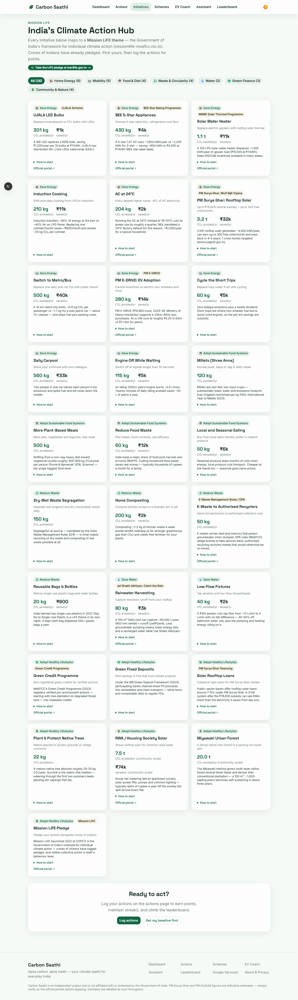

# Carbon Saathi

> **Version 0.4.3** — live on Cloud Run with 30-second gamified onboarding, a 301-test unit/integration suite and a 40+-spec e2e/a11y gate.

**Your climate saathi for everyday India.** Measure, understand, and reduce your carbon
footprint through simple actions and personalised insights — grounded in real Indian schemes
(PM Surya Ghar, PM KUSUM), EV adoption guidance, and a Gemini-powered coach.

India's energy-related footprint averages **~2 tonnes CO₂e per person per year**, but urban
affluent lifestyles already run at **~4 tonnes**. Carbon Saathi turns that abstract gap into a
personal baseline, a daily action habit, and concrete rupee-denominated next steps — like a
rooftop solar plan with the exact **₹30,000 / ₹60,000 / ₹78,000** PM Surya Ghar subsidy band
and payback years for _your_ electricity bill.


_The post-quiz dashboard: footprint donut, badge wall, streak and daily pledge in one bento grid — captured by the Playwright screenshot suite._

Built with **Google Antigravity + Gemini**.

> **Live demo**: [https://carbon-saathi-web-ktdjm6xcyq-el.a.run.app](https://carbon-saathi-web-ktdjm6xcyq-el.a.run.app) (Cloud Run, asia-south1 — Mumbai, closest region to the users this app serves)
> **API**: [https://carbon-saathi-api-ktdjm6xcyq-el.a.run.app/api/health](https://carbon-saathi-api-ktdjm6xcyq-el.a.run.app/api/health) — live Gemini 2.5-flash, `demoMode: false`

**30-second verification for evaluators**

1. `curl https://carbon-saathi-api-ktdjm6xcyq-el.a.run.app/api/health` → expect
   `{"status":"ok","version":"0.4.3","demoMode":false}` (plus a live `uptimeSec`) — live
   Gemini with a two-transport failover chain, keys via Secret Manager.
2. Open the live demo and take the 30-second quiz on the landing page — you'll own a dashboard with a badge in under a minute.
3. Visit `/google-services` for the self-reporting integration catalog (served by the API, rendered on Cloud Run).
4. Clone and run with **zero keys**: `npm install && npm test && npm run dev` — every feature degrades to a deterministic demo mode.
5. Rubric-axis → evidence index: [EVALUATION_MAPPING.md](EVALUATION_MAPPING.md).

---

## The problem

- **Your footprint is invisible.** Most Indians sit somewhere between the ~2 t national
  average and the ~4 t urban-affluent reality — and have no way to know which, because
  nothing ever measures _them_.
- **₹78,000 goes unclaimed.** PM Surya Ghar pays ₹30,000 / ₹60,000 / ₹78,000 toward rooftop
  solar, yet most eligible homes never apply — sizing, subsidy bands and payback math are
  buried in scheme PDFs.
- **Awareness never becomes action.** Climate intent decays within a day when there is no
  habit loop: no streaks, no points, no daily nudge denominated in kg CO₂ and rupees.
- **Generic advice ignores India.** Western calculators miss CEA's 0.716 kg CO₂/kWh grid
  factor, LPG cylinders, Indian commute modes — and every Indian scheme — so their advice
  doesn't convert here.

**Carbon Saathi turns the invisible into a measured baseline, the unclaimed into a checklist, and awareness into a daily habit — in 30 seconds, in rupees, for India.**

## The solution

| Feature                                  | What it does                                                                                             | Google service                                               |
| ---------------------------------------- | -------------------------------------------------------------------------------------------------------- | ------------------------------------------------------------ |
| **30-second quiz**                       | 5 taps on the landing page → instant CO₂ estimate → personal dashboard with a first badge, no sign-up    | Cloud Run (web + API, asia-south1)                           |
| **Saathi Chat**                          | AI coach grounded in _your_ calculator outputs — never invented numbers, deterministic demo fallback     | Gemini 2.5-flash, key via Secret Manager                     |
| **PM Surya Ghar / PM KUSUM calculators** | Rooftop kW sizing with the ₹30k/₹60k/₹78k subsidy bands and payback years; farmer routing to KUSUM A/B/C | Cloud Run API; outputs ground Gemini replies                 |
| **Initiatives Hub**                      | Searchable catalog of 25+ sourced Mission LiFE initiatives with derived CO₂/₹ figures                    | Cloud Run + Cloud Logging                                    |
| **Badges + pledge loop**                 | 8 badges awarded server-side, streak shields, and a daily pledge that pays a 1.2× points bonus           | Cloud Run API (server-side rules)                            |
| **Live deployment**                      | Both services built, stored and served from Mumbai with secrets mounted by reference                     | Cloud Build → Artifact Registry → Cloud Run · Secret Manager |

## ✨ Highlights

| Rubric axis         | How Carbon Saathi delivers                                                                                                                                                                                                                                                                                                                                                                                                                                                                                                                                                                           |
| ------------------- | ---------------------------------------------------------------------------------------------------------------------------------------------------------------------------------------------------------------------------------------------------------------------------------------------------------------------------------------------------------------------------------------------------------------------------------------------------------------------------------------------------------------------------------------------------------------------------------------------------- |
| **Code Quality**    | TypeScript strict mode across all three workspaces. Pure deterministic domain engine in [`packages/core`](packages/core/src) with `Result<T, AppError>` instead of cross-boundary throws ([`result.ts`](packages/core/src/result.ts), [`errors.ts`](packages/core/src/errors.ts)). Sourced constants live in one place and are imported, not re-typed ([`emission-factors.ts`](packages/core/src/emission-factors.ts), [`schemas.ts`](packages/core/src/schemas.ts) bounds). Repo-wide ESLint with zero suppressions; shared zod schemas validate the same payloads in web forms and API middleware. |
| **Security**        | Helmet CSP, CORS allowlist, 32 kb JSON body cap, per-IP token-bucket rate limiting (stricter on the assistant), zod validation on every POST, prompt-injection boundary delimiters around all untrusted input ([`prompt-boundary.ts`](apps/api/src/services/prompt-boundary.ts)), secrets only via env (names — never values — exposed by the evidence route, with a test asserting it). Full threat table: [SECURITY.md](SECURITY.md).                                                                                                                                                              |
| **Efficiency**      | Zero-dependency domain core (zod only), in-memory stores and caches with a pagination-ready interface, deterministic fallbacks instead of network retries, ≤180-word assistant token budget, lazy-loaded heavy UI, structured logs (no payload echo). Decisions documented in [ARCHITECTURE.md](ARCHITECTURE.md#efficiency-decisions).                                                                                                                                                                                                                                                               |
| **Testing**         | Unit (one vitest file per core module, [`packages/core/src/__tests__`](packages/core/src/__tests__)), API integration via supertest ([`apps/api/src/__tests__`](apps/api/src/__tests__)), web component tests (RTL + jsdom), Playwright e2e journeys, and automated axe-core accessibility scans ([`e2e/a11y.spec.ts`](e2e/a11y.spec.ts)). Layer matrix and honest gaps: [TESTING.md](TESTING.md).                                                                                                                                                                                                   |
| **Accessibility**   | WCAG 2.1 AA by design: skip-link, semantic landmarks, labelled inputs, focus-visible rings, 4.5:1+ token contrast (computed ratios documented), full keyboard journey, `aria-live` feedback, `prefers-reduced-motion` honoured in CSS and framer-motion. Evidence: [ACCESSIBILITY.md](ACCESSIBILITY.md).                                                                                                                                                                                                                                                                                             |
| **Google Services** | 12 integrations in a typed, API-served catalog ([`service-catalog.ts`](packages/core/src/google/service-catalog.ts)) — **six live in production**: Gemini API (2.5-flash), Cloud Run (both services, asia-south1), Cloud Build (every deploy), Artifact Registry, Cloud Logging, Secret Manager (Gemini key mounted by reference). Maps + GA4 ready-with-key; Firebase trio planned with interfaces ready. Live evidence page at `/google-services`. Per-service contract: [GOOGLE_SERVICES.md](GOOGLE_SERVICES.md).                                                                                 |

## 🌱 What it does

- **30-second quiz onboarding** — a cold visitor answers 5 taps on the landing page, gets an
  instant CO₂ estimate, and lands on a personal dashboard with their first badge — no sign-up,
  under a minute (`packages/core/src/quick-quiz.ts` → `POST /api/quiz/estimate`).
- **Baseline footprint survey** — 5-step wizard converts household electricity, LPG, commute,
  flights, diet, and shopping into annual kg CO₂e per person, benchmarked against the
  India average (~2 t) and urban affluent (~4 t), using CEA's grid factor of
  **0.716 kg CO₂/kWh**.
- **Badges & daily pledge** — an 8-badge catalog awarded server-side (first quiz, first action,
  streak milestones, 10 kg saved, weekly mission, pledge kept), plus a daily pledge: commit to
  one action and earn a **1.2× points bonus** when you log it the same day.
- **Initiatives Hub** — searchable catalog of 25+ sourced climate initiatives across Mission LiFE's themes (UJALA,
  BEE star ratings, PM E-DRIVE, Green Credit Programme, Jal Shakti, Miyawaki forests …) with
  per-initiative CO₂/₹ figures derived from the same emission factors as the calculators.
- **Daily action log** — a 12-action catalog (metro instead of car, veg day, AC +1 °C, …)
  with per-unit CO₂ savings, points, levels (Seed → Forest), streaks with shields, and
  weekly missions.
- **PM Surya Ghar calculator** — recommends rooftop kW from your monthly units, applies the
  central subsidy bands (₹30k for 1 kW, ₹60k for 2 kW, ₹78k cap at 3 kW+), explains the
  **300 free units** narrative, and outputs payback years plus a 6-step application checklist
  linking [pmsuryaghar.gov.in](https://pmsuryaghar.gov.in).
- **PM KUSUM advisor** — routes farmers to Component A/B/C with the **30% central + 30% state
  / 40% farmer** split, diesel litres displaced, and CO₂ avoided.
- **EV fit coach** — recommendation engine (EV 2-wheeler / EV car / hybrid /
  public-transport-first) with annual CO₂ and fuel-cost savings.
- **Commute comparison** — per-mode CO₂ and cost for your distance; uses Google Maps
  Distance Matrix when a key is present, deterministic estimates otherwise.
- **Saathi Chat** — Gemini-powered coach grounded in _your_ calculator outputs
  (never invented numbers), with a deterministic demo mode that reuses the same math.
- **Leaderboard & circles** — friendly competition seeded with deterministic demo entries.

## Tech stack

- **Language** — TypeScript strict everywhere (zero `any`), one shared [`tsconfig.base.json`](tsconfig.base.json)
- **Web** — Next.js 15 (App Router) + React 19 + Tailwind v4
- **API** — Express 4 + zod (`.strict()` schemas shared from the core package)
- **Testing** — vitest + Testing Library + Playwright + axe-core
- **Lint / format** — ESLint (typescript-eslint) + Prettier
- **Delivery** — Docker + Cloud Build → Artifact Registry → Cloud Run (asia-south1)
- **AI** — Gemini 2.5-flash, key mounted by reference from Secret Manager

## 🚀 Quick start

Three commands, zero keys required:

```bash
npm install     # Node >= 20; installs all workspaces
npm test        # core unit + API integration + web component suites
npm run dev     # boots API on :8080 and web on :3000
```

Then open **http://localhost:3000**.

**Demo mode (default):** with no API keys configured, `DEMO_MODE=true` and every Google
integration degrades gracefully — the assistant returns deterministic replies built from the
_same_ calculator outputs, commute comparison uses labelled estimates, and all 11 pages
render fully. Copy [`.env.example`](.env.example) to `.env` and add keys whenever you want
live Gemini/Maps; nothing else changes. See [GOOGLE_SERVICES.md](GOOGLE_SERVICES.md) for the
per-service activation walkthrough.

End-to-end and accessibility suites (require the dev servers' ports to be free):

```bash
npm run e2e     # Playwright: smoke, journey (incl. the quiz funnel), schemes, assistant
npm run a11y    # axe-core scan across all 11 routes
```

## Docker quick start

Build context is the repo root (the Dockerfiles copy the workspace manifests) — these are
the exact images Cloud Build ships to Cloud Run:

```bash
docker build -f apps/api/Dockerfile -t saathi-api . && docker run -p 8080:8080 saathi-api
docker build -f apps/web/Dockerfile -t saathi-web . && docker run -p 3000:3000 saathi-web
```

## 🧹 Code quality

Every claim below is verifiable in-repo:

- **Strict TypeScript everywhere** — `"strict": true` in [`tsconfig.base.json`](tsconfig.base.json); zero `any`, zero non-null `!` assertions, zero `@ts-ignore` in source.
- **ESLint (typescript-eslint) across core, api, e2e and the web app — zero suppressions.**
- **99% statement coverage on the domain engine** (99.36% stmts, 100% functions), measured by `vitest --coverage` in CI.
- **Pure domain core** — calculators never throw across boundaries: [`Result<T, AppError>`](packages/core/src/result.ts) is the only error channel.
- **Every number carries its source** — emission factors, subsidy bands and initiative figures all cite provenance inline ([`emission-factors.ts`](packages/core/src/emission-factors.ts), [`initiatives.ts`](packages/core/src/initiatives.ts)).
- **One wire contract** — shared zod schemas ([`schemas.ts`](packages/core/src/schemas.ts), `.strict()` at request boundaries) keep web and API in lock-step; drift is a compile error.
- **File-header convention** — every source file opens with a responsibility + boundary comment (what it owns vs what callers own).
- **A vitest file per core module** + integration tests per API route + RTL component tests + Playwright e2e/a11y — all run by [CI on every push](.github/workflows/ci.yml).
- **Prettier-formatted**, conventional naming throughout.

## 📸 Screenshots

Captured by the Playwright suite into [`e2e/screenshots/`](e2e/screenshots)
(regenerate anytime with `npx playwright test e2e/screenshots.spec.ts`):

| Light                                                                                    | Dark                                                               |
| ---------------------------------------------------------------------------------------- | ------------------------------------------------------------------ |
|                                              |        |
|  |  |

| Flow                                                  | Capture                                                                       |
| ----------------------------------------------------- | ----------------------------------------------------------------------------- |
| PM Surya Ghar calculator result (350 units → ₹78,000) |     |
| Saathi Chat replying with grounded numbers            |  |
| Action logging catalog                                |                                   |
| EV fit coach                                          |                               |
| Leaderboard with your row highlighted                 |                                |
| Initiatives hub (Mission LiFE catalog)                |                            |
| Google services evidence page                         |                |

## 🏗️ Architecture at a glance

```
┌────────────────────────────┐      ┌─────────────────────────────┐
│  apps/web  (Next.js 15)    │ /api │  apps/api  (Express 4)      │
│  App Router · React 19     ├─────►│  Cloud Run-ready · helmet   │
│  Tailwind v4 · framer      │proxy │  CORS · rate limit · zod    │
└────────────┬───────────────┘      └──────────────┬──────────────┘
             │  imports types/schemas              │ imports calculators
             ▼                                     ▼
        ┌─────────────────────────────────────────────────┐
        │  packages/core  (@carbon-saathi/core)           │
        │  pure, deterministic domain engine — zod only   │
        └─────────────────────────────────────────────────┘
                       │ outbound (optional, key-gated)
                       ▼
        Gemini API · Maps Distance Matrix · (Firestore roadmap)
```

Full diagrams and data flows (baseline calc, action log, assistant grounding, commute
fallback): [ARCHITECTURE.md](ARCHITECTURE.md).

## 🗂️ Monorepo file index

The tree gives the shape; the table after it tells you when to read each file.

```
carbon-saathi/
├── packages/core/                   # Pure domain engine — deterministic, zod is the only dependency
│   └── src/
│       ├── emission-factors.ts      # Every India-specific factor, provenance cited inline
│       ├── baseline.ts              # Survey → annual kg CO₂e per person
│       ├── quick-quiz.ts            # 30-second quiz → instant estimate mapping
│       ├── surya-ghar.ts            # Rooftop kW sizing, ₹30k/₹60k/₹78k bands, payback years
│       ├── kusum.ts                 # PM KUSUM A/B/C routing + subsidy split
│       ├── ev-fit.ts                # EV recommendation decision tree
│       ├── commute.ts               # Per-mode CO₂ + cost comparison
│       ├── actions.ts               # 12-action catalog with anti-gaming daily caps
│       ├── gamification.ts          # Points, levels, streak shields, pledge bonus
│       ├── badges.ts                # 8-badge catalog, table-driven award rules
│       ├── initiatives.ts           # Mission LiFE catalog, 25+ sourced initiatives
│       ├── schemas.ts               # Shared zod wire contract (.strict() at boundaries)
│       ├── result.ts                # Result<T, AppError> — the only error channel
│       ├── errors.ts                # Typed error codes shared by API and web
│       ├── google/service-catalog.ts  # Typed Google-integration evidence catalog
│       └── __tests__/               # 16 vitest files — one per core module
├── apps/api/                        # Express 4 service (Cloud Run, port 8080)
│   ├── src/server.ts                # buildApp() factory — helmet, CORS, rate limits wired here
│   ├── src/routes/                  # 13 endpoints, zod-validated at the boundary
│   ├── src/services/                # Gemini client, prompt boundary, grounding, user store
│   ├── src/middleware/              # validate, token-bucket rate limit, structured logger
│   ├── src/__tests__/               # 8 supertest integration suites
│   └── Dockerfile                   # Multi-stage build, non-root runtime user
├── apps/web/                        # Next.js 15 App Router (Cloud Run, port 3000)
│   ├── app/                         # 11 routes: landing, dashboard, schemes, assistant, …
│   ├── components/                  # UI kit + gamification widgets, RTL tests alongside
│   ├── lib/                         # Typed api-client, resilient storage, shared contexts
│   └── Dockerfile                   # Standalone-output image
├── e2e/                             # Playwright: smoke, journey, schemes, assistant, a11y
│   └── screenshots/                 # README evidence PNGs (regenerated by screenshots.spec.ts)
├── scripts/deploy.ps1               # One-command Cloud Build → Cloud Run deploy
├── .github/workflows/ci.yml         # Type-check, unit/integration, e2e + a11y on every push
├── cloudbuild-api.yaml              # Cloud Build recipe → Artifact Registry → Cloud Run (API)
├── cloudbuild-web.yaml              # Same pipeline for the web service
├── ARCHITECTURE.md                  # Layering + data-flow diagrams
├── SECURITY.md                      # Threat table — every mitigation links to code
├── TESTING.md                       # Layer matrix, commands, honest gaps
├── ACCESSIBILITY.md                 # WCAG 2.1 AA evidence
├── GOOGLE_SERVICES.md               # Per-service integration contract
├── EVALUATION_MAPPING.md            # Rubric axis → file-path index
├── PROMPTS.md                       # The staged build prompts behind the repo
├── tasks.md                         # Phase-wise plan (0–13) with status
└── CHANGELOG.md                     # Release history (SemVer)
```

| Path                                                                                         | What lives here                                              | When to read                                |
| -------------------------------------------------------------------------------------------- | ------------------------------------------------------------ | ------------------------------------------- |
| [`packages/core/src/emission-factors.ts`](packages/core/src/emission-factors.ts)             | Every India-specific factor with provenance                  | To audit any number the app shows           |
| [`packages/core/src/baseline.ts`](packages/core/src/baseline.ts)                             | Survey → annual footprint math                               | To verify the footprint calculation         |
| [`packages/core/src/surya-ghar.ts`](packages/core/src/surya-ghar.ts)                         | PM Surya Ghar sizing, subsidy bands, payback                 | To check the solar economics                |
| [`packages/core/src/kusum.ts`](packages/core/src/kusum.ts)                                   | PM KUSUM A/B/C routing + subsidy split                       | To check the farmer advisory                |
| [`packages/core/src/ev-fit.ts`](packages/core/src/ev-fit.ts)                                 | EV recommendation decision tree                              | To check EV savings claims                  |
| [`packages/core/src/actions.ts`](packages/core/src/actions.ts)                               | 12-action catalog with per-day caps                          | To see anti-gaming bounds                   |
| [`packages/core/src/gamification.ts`](packages/core/src/gamification.ts)                     | Points, levels, streak shields, missions, pledge bonus       | To understand the habit loop                |
| [`packages/core/src/quick-quiz.ts`](packages/core/src/quick-quiz.ts)                         | 30-second quiz → survey mapping → instant estimate           | To verify the quiz funnel math              |
| [`packages/core/src/badges.ts`](packages/core/src/badges.ts)                                 | 8-badge catalog with table-driven award rules                | To see how badges are earned                |
| [`packages/core/src/initiatives.ts`](packages/core/src/initiatives.ts)                       | Mission LiFE catalog, 25+ sourced initiatives                | To audit the initiative figures             |
| [`packages/core/src/google/service-catalog.ts`](packages/core/src/google/service-catalog.ts) | Typed Google-integration evidence catalog                    | To verify Google Services claims            |
| [`packages/core/src/__tests__/`](packages/core/src/__tests__)                                | One vitest file per core module                              | To see realistic Indian test scenarios      |
| [`apps/api/src/server.ts`](apps/api/src/server.ts)                                           | `buildApp(config)` factory — all hardening wired here        | To review the security middleware stack     |
| [`apps/api/src/services/assistant.ts`](apps/api/src/services/assistant.ts)                   | Grounding pipeline: calculators → prompt → Gemini            | To review the AI safety design              |
| [`apps/api/src/services/prompt-boundary.ts`](apps/api/src/services/prompt-boundary.ts)       | Untrusted-input delimiter wrapping                           | To review prompt-injection defence          |
| [`apps/api/src/services/store.ts`](apps/api/src/services/store.ts)                           | `UserStore` interface + in-memory impl                       | To see the Firestore-ready persistence seam |
| [`apps/web/app/`](apps/web/app)                                                              | 11 App Router pages                                          | To explore the UX                           |
| [`scripts/deploy.ps1`](scripts/deploy.ps1)                                                   | One-command Cloud Run deploy (Cloud Build + Secret Manager)  | To reproduce the live deployment            |
| [`apps/web/lib/`](apps/web/lib)                                                              | Typed api-client, storage with corruption recovery, contexts | To review client-side robustness            |
| [`e2e/`](e2e)                                                                                | Playwright smoke/journey/schemes/assistant/a11y specs        | To see the user journeys exercised          |
| [`.env.example`](.env.example)                                                               | Environment schema of record                                 | Before configuring any key                  |
| [`tasks.md`](tasks.md)                                                                       | Phase-wise build plan (0–13) with status                     | To see what is done vs roadmap              |

## 🔌 Google services

| Service                | Status                                          | Fallback without key                                 |
| ---------------------- | ----------------------------------------------- | ---------------------------------------------------- |
| Gemini API (AI Studio) | `implemented` — live, 2.5-flash                 | Deterministic demo replies from the same calculators |
| Cloud Run              | `implemented` — both services live, asia-south1 | Runs as a plain Node process                         |
| Cloud Build            | `implemented` — builds every deploy             | Local `docker build` with the same Dockerfiles       |
| Artifact Registry      | `implemented` — regional image store            | Any OCI registry                                     |
| Cloud Logging          | `implemented` — live ingestion                  | stdout JSON lines                                    |
| Secret Manager         | `implemented` — Gemini key mounted by reference | Git-ignored `.env` files                             |
| Maps Distance Matrix   | `ready-with-key`                                | Labelled distance estimate                           |
| Maps JavaScript API    | `ready-with-key`                                | Static comparison, no interactive map                |
| Google Analytics 4     | `ready-with-key`                                | Zero tracking by default                             |
| Firebase Auth          | `planned`                                       | Anonymous local profiles (no PII)                    |
| Cloud Firestore        | `planned`                                       | `InMemoryUserStore` behind the same interface        |
| Firebase Hosting       | `planned`                                       | Any static host                                      |

Live, self-reporting version: `GET /api/google/services` rendered at `/google-services`.
Full contract: [GOOGLE_SERVICES.md](GOOGLE_SERVICES.md).

## Repository hygiene

The tracked tree contains only source, tests, configuration and rubric evidence. The PNGs
under [`e2e/screenshots/`](e2e/screenshots) are regenerated by
[`e2e/screenshots.spec.ts`](e2e/screenshots.spec.ts); build outputs, reports, dependency
folders and working notes are git-ignored and live outside the tree.

## 🧭 For evaluators

- Rubric-axis → file-path mapping: [EVALUATION_MAPPING.md](EVALUATION_MAPPING.md)
- Threat model and responsible-AI notes: [SECURITY.md](SECURITY.md)
- Test layers, commands, coverage, gaps: [TESTING.md](TESTING.md)
- WCAG evidence: [ACCESSIBILITY.md](ACCESSIBILITY.md)
- The staged build prompts that drove this repo: [PROMPTS.md](PROMPTS.md)
- Release history: [CHANGELOG.md](CHANGELOG.md)

## 📄 License

MIT — see [LICENSE](LICENSE).

Built for **Google PromptWars** (Hack2Skill) with **Google Antigravity + Gemini**.
Scheme figures reflect published PM Surya Ghar / PM KUSUM guidelines at build time; all
outputs are estimates, not financial advice — official portals are linked everywhere a
number appears.
